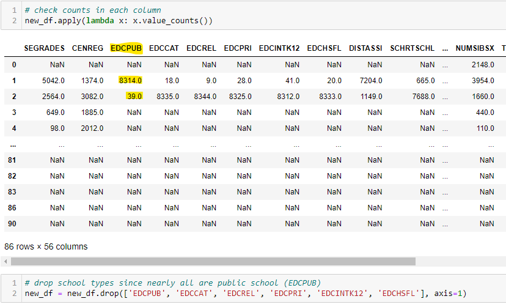
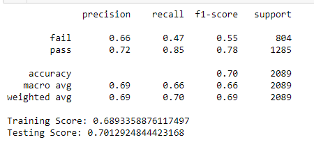
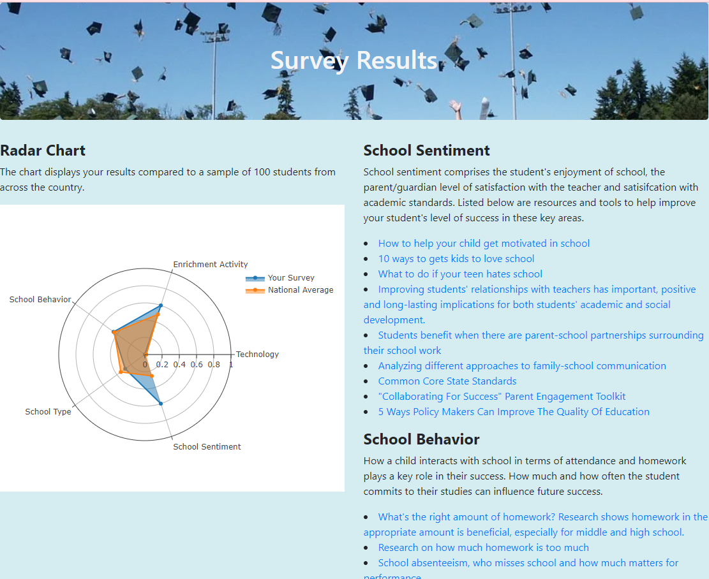

# Student Success Analysis

#### [Presentation link](segment_3_presentation.pdf)

## Topic
We have decided to investigate what factors contribute the greatest student success in K-12 education.  With more education choices than ever before with remote learning, home schooling, hybrid solutions, public schools, private schools, etc., will different combinations of factors yield greater academic success than others and how might those factors change with different educational paths.  Are we able to predict the success of a student based on different factors?

## Data Source
Our data source comes from the National Center for Education Statistics, which bears the responsibility of the collection, analysis and reporting of data pertaining to education within the United States.  We are using a csv that compiles the results of the 2019 National Household Education Surveys Program.  We have elected to focus on the Parent and Family Involvement in Education (PFI) survey.  The survey contains data completed with parents or guardians of 16,446 children age 20 or younger who were enrolled in grades K through 12.

## Questions 
We hope to answer the following questions:
  - What combination of factors yield the greatest student success?
  - How do those factors differ for success with different education paths, such as remote learning?

## Dream Team Protocols
We have named our project group the Dream Team.  We hae settled on a quick daily checkin at 6:00 via Slack.  Future meetings may be scheduled as needed depending on challenges presented throughout the project.  

## Data Management
The cleaned and processed data will be housed in an Postgres database hosted by Heroku. This includes the train and test data, survey responses and feature importance. Below is a link to the ERD:

[Database_ERD](./Resources/Database_ERD.sql)

The data will then be pulled in for use in the dashboard.

## Front End
The front end is a Flask site using Bootstrap hosted by Heroku. People can submit answers to a selection of questions picked from the National Household Education Surveys Program. These answers can then be used to train and/or test the model moving forward. The immediate use of the answers will be to provide recommendations on what parents can do to improve their childs success. The results will be displayed on the dashboard. The front end can be accessed here:

https://student-success-analysis.herokuapp.com/

## Machine Learning Model

 - We began our preliminary data preprocessing by eliminating columns from the original csv that did not pertain to our questions.  This left us with 16,446 rows of data.  From there, we removed rows with a -1 or -9 as a value, which represented variables that were not applicable or were missing.  This left us with 8,353 rows across 56 columns.  We then ran a value count for each column and decided to eliminate school types to help minimize noise since 8,314 rows were public schools.  
 
  
 We then binned the following columns:
   - Grades:  We combined grades into passing and failing categories.  
   - Parent Ages:  Due to the vast range in ages, we binned them into 5 ranges.
   - Homework Hours:  Due to the vast range, we binned them into 4 ranges
   - Number of Family Dinners Weekly:  These were binned into 4 ranges
   - Total Household Income:  These were consolidated from 12 categories to 4 categories.

   ```
   # Consolidate P1AGE ahd P2AGE
range_1 = range(15, 30, 1)
range_2 = range(30, 45, 1)
range_3 = range(45, 60, 1)
range_4 = range(60, 75, 1)
range_5 = range(75, 100, 1)

# P1AGE
new_df["P1AGE"] = [(1 if x in range_1 else (2 if x in range_2 else (3 if x in range_3 else (4 if x in range_4 else 5)))) for x in new_df["P1AGE"]]

# P2AGE
new_df["P2AGE"] = [(1 if x in range_1 else (2 if x in range_2 else (3 if x in range_3 else (4 if x in range_4 else 5)))) for x in new_df["P2AGE"]]

# Consolidate FHWKHRS
range_1 = range(0, 20, 1)
range_2 = range(20, 40, 1)
range_3 = range(40, 60, 1)
range_4 = range(60, 80, 1)

new_df["FHWKHRS"] = [(1 if x in range_1 else (2 if x in range_2 else (3 if x in range_3 else 4))) for x in new_df["FHWKHRS"]]
        
# Consolidate FODINNERX
new_df["FODINNERX"] = [(1 if x <= 0 <= 2 else (2 if x <= 3 <= 4 else (3 if x <= 5 <= 6 else 4))) for x in new_df["FODINNERX"]]

# Consolidate TTLHHINC
new_df["TTLHHINC"] = [(1 if x <= 4 else (2 if x < 9 else (3 if x < 11 else 4))) for x in new_df["TTLHHINC"]]
```
 
 Then we wrote the resulting dataframe to our Postgres database hosted by Heroku.  The jupyter notebook used for cleaning the data can be found here: [sanitize_data](Resources/sanitize_data.ipynb)

 - To determine feature selection, we first connected to the database and pulled the table into a dataframe for review.  A correlation matrix was generated for review.  We selected SEGRADES as our target and left the other 49 columns as our features. 

 - The data was split into training and testing datasets using the default split of .75 for training and .25 for testing.  While we did experiment with different splits, the results weren't significantly different so we decided that utilizing the defaults was sufficient.  The datasets were stratified.  We split the encoding of the X_train datasets and the X_test datasets up so that we could see what exactly was going into each.  We discovered an issue with the binning of the age ranges by doing this.  The X_test was short by two columns because there wasn't enough span in the ages in the 1st range.  We revised the age ranges so there was a greater span of ages.

 - Since all of our data was classification data, we began by using the Random Forest Classifier and the Extremely Random Forest Classifier.  However, we discovered that these models were overfitting the training data unless we limited nearly all of our categories.  So, we then turned to AdaBoost Classifier since it known for working well with binary classification.  AdaBoost would continue to correct errors of the preceding model to help improve our accuracy.  We benefited from the continual learning to help improve the model.  A limitation is that the dataset has to really have minimal noise.  We originally used pd.dummies to encode the data but then switched to OneHotEncoder so that we could employ the parameter of dropping the 1st category if it were binary (Yes or No) but retain all the columns if it was just a classification.  This worked well until later on when building out the radar chart for the results dashboard, we noticed the scores were not making sense.  The issue was that the Yes data in the dataset was coded as a "1" and No data was coded as a "2".  When the encoder dropped the first binary column, it dropped the Yes data column since it was the first column.  We then went back and manually dropped the No columns instead.  Re-running the model again, there was no difference in scores but made the development of the dashboard easier.

 - The current accuracy score is 70%.

 

 - We then used the feature importances to determine how the model weighted each category.  The top ten features were as follows:
   - SEENJOY_1:  The parent strongly agrees that the child enjoys school.
   - FORESPON_1:  In the past week, the parent indicates that they have discussed time management with the child.
   - CENREG_4:  The child lives in the census region West (Alaska, Arizona, California, Colorado, Hawaii, Idaho, Montana, Nevada, New 
     Mexico, Oregon, Utah, Washington, and Wyoming)
   - P1AGE_2:  The first parent/guardian's age is within the range of 30-45 years.
   - HHPRTNRSX_1: The parent's girlfriend/boyfriend/partner lives in the same household as the child.
   - TTLHHINC_4:  The total household income is greater than $200k
   - SEENJOY_3: The parent disagrees that the child enjoys school.
   - FCTEACHR_1: The parent reports being very satisifed with the teacher.
   - P2AGE_2: The second parent/guardian's age is within the range of 30-45 years.
   - FOGAMES_1: In the past week, the child has played board games.

- While not every features such as census region, age of parent,the presence of a another adult in the household, and household income is easily controlled by the parent/guardian, we decided to feature items that were within control of the parent to make a difference in the child's success of achieving mostly A's.  We focused on features that had a value score greater than .01 and then eliminated rows that were out of the parent/guardian's control.  These were then grouped into categories and put into a dataframe.

```
# remove features with a feature importance value less than .01
feature_data_df = feature_data_df.loc[(feature_data_df["value"]>.01)]
feature_list = feature_data_df["feature"].tolist()
```
```
# remove feature rows that parents cannot control.  Will use remainder of features to display features in front end
# that parents can improve up and within their control.
feature_data_df = feature_data_df.drop([2,3,4,5,8,11,12,13,14,15,19,20,24,25,26,27,28,32,33,35,36])
```
```
# create function to map the groups
def set_group(row_number, assigned_group):
    return assigned_group[row_number]

# create dictionary of groups
group_dict = {'SEENJOY_1': "School Sentiment",
 'FORESPON_1': 'Enrichment Activity',
 'SEENJOY_3': "School Sentiment",
 'FCTEACHR_1': 'School Sentiment',
 'FOGAMES_1': 'Enrichment Activity',
 'FOHISTX_1': 'Enrichment Activity',
 'FHHOME_4': 'School Behavior',
 'SEABSNT_1': 'School Sentiment',
 'SCHRTSCHL_1': 'School Type',
 'SEABSNT_4': 'School Behavior',
 'INTACC_4': 'Technology',
 'FHWKHRS_1': 'School Behavior',
 'LRNCELL_2': 'Technology',
 'FOLIBRAYX_1': 'Enrichment Activity',
 'FOSTORY2X_1': 'Enrichment Activity',
 'FOMUSEUMX_1': 'Enrichment Activity',
 'FCSTDS_4': 'School Sentiment',
 'SCHLMAGNET_1': 'School Type',
 'FOCONCRTX_1': 'Enrichment Activity',
 'FOBOOKSTX_1': 'Enrichment Activity',
 'FHWKHRS_3': 'School Behavior',
 'DISTASSI_1': 'School Type',
 'CHLDNT_3': 'Technology'}

# add new column and apply groups
feature_data_df['group'] = feature_data_df['feature'].apply(set_group, args=(group_dict, ))
```
We then loaded these features into the Features table of the database to use for the radar chart and resource suggestions on the dashboard.

The machine learning notebook can be found here: [student_success_ml](Optimize\Student_Success_ML.ipynb)

## Dashboard
The dashboard is displayed upon completion of the student survey.  It is a Flask site using Bootstrap hosted by Heroku.  A radar chart is created based upon the user's responses to the survey questions to visualize the results.  Within the [app.py](app.py) file, the chart data is retrieved for the display.  In addition, parental resources were added via a backend site and are also displayed by grouping on the dashboard.

